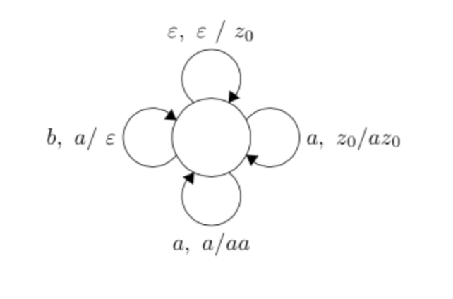

# PDA2CFG

The program converts pushdown automata to context-free grammar.  

The letters are numerated from 1 to let_quantity, where let_quantity - quantity of letters.  
z0 = let_quantity + 1  
epsilon = 0.  
Nonterminal symbols are numerated from let_quantity + 2, where let_quantity + 2 is start symbol.

## Input Specifying

V - the quantity of automata's states  
E - the quantity of relations  
initial - initial state of automata  
let_quantity - quantity of letters  
Then inputs E lines:  
u let stack_pop v stack_push_len a1 a2 .. astack_push_len  
Each line inputs for relation (u, let, stack_pop) -> (v, a1 ... astack_push_len), where u, v - states, let - the input, stack_pop - topmost stack symbol, a1 ... astack_push_len - symbols added to the stack.  

## Output Specifying

N - quantity of rules in the new grammar  
Then N lines:  
S len_right a1 ... alen_right, whereS - nonterminal symbols on the left-hand side, len_right - length of the right-hand side, ai - symbol of the right-hand side  

# Example

## Input

    1 4
    0
    2
    0 0 3 0 1
    0
    0 1 3 0 2
    1 3
    0 1 1 0 2
    1 1
    0 2 1 0 1
    0

## Output

    5
    4 1
    5 
    5 1
    0 
    5 3
    1 6 5 
    6 3
    1 6 6
    6 1
    2